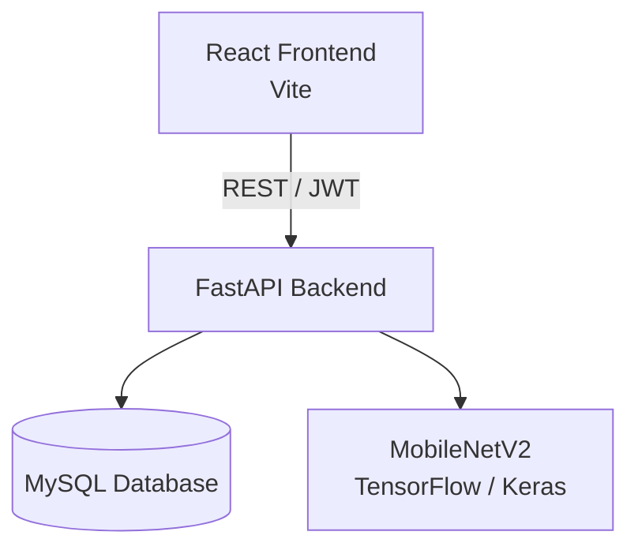

# Architecture — VisionInspectIA

Version courte. Pour le détail complet, voir [TECHNICAL_DOCUMENTATION.md](TECHNICAL_DOCUMENTATION.md).

## Schéma global



## Rôle de chaque couche

| Couche | Rôle |
|---|---|
| **React (Vite)** | Interface utilisateur. Aucune logique métier — consomme l'API REST via `src/api/`. |
| **FastAPI** | API REST. Point d'entrée unique de la logique applicative : authentification JWT, upload, prédiction, historique, statistiques, PDF. |
| **MySQL** | Persistance de deux tables : `users` et `inspections` (relation 1–N). |
| **MobileNetV2 (TensorFlow)** | Modèle de classification d'images, chargé une seule fois en mémoire au démarrage du serveur, jamais rechargé ensuite. |

## Organisation interne du backend

```
app/
├── core/       # Configuration, sécurité (hash, JWT)
├── api/        # Routes HTTP uniquement
├── db/         # Connexion et session SQLAlchemy
├── models/     # Tables SQLAlchemy
├── schemas/    # Validation Pydantic
├── services/   # Toute la logique métier
├── ml/         # Chargement du modèle et prétraitement
└── utils/      # Fonctions utilitaires (fichiers, PDF)
```

Règle appliquée dans le code : `api/` appelle `services/`, qui seul contient la logique.

## Organisation interne du frontend

```
src/
├── api/          # Appels HTTP centralisés
├── components/   # Composants réutilisables, par fonctionnalité
├── pages/        # Écrans
├── context/      # État global (Auth, Theme, Toast)
├── hooks/        # Hooks personnalisés
├── routes/       # Routage et protection des pages privées
├── layouts/      # Mise en page commune
└── utils/        # Statistiques dashboard, export CSV
```

## Pipeline de prédiction (résumé)

```
Image → validation → sauvegarde disque → preprocessing (224x224)
      → MobileNetV2 (déjà en mémoire) → classe + confiance + temps d'inférence
      → enregistrement MySQL → réponse JSON au frontend
```

## Endpoints principaux

| Domaine | Routes |
|---|---|
| Auth | `POST /auth/register`, `POST /auth/login`, `GET /auth/me`, `POST /auth/logout` |
| Users | `PUT /users/me`, `PUT /users/me/password`, `DELETE /users/me` |
| Predictions | `POST /predictions/predict` |
| History | `GET /history`, `GET /history/{id}`, `DELETE /history/{id}` |
| Dashboard | `GET /dashboard/statistics` |
| Reports | `GET /reports/{inspection_id}` |

## Modèle retenu

**MobileNetV2**, dans les conditions expérimentales du projet, comme meilleur compromis entre performances (75,63 % accuracy, F1 macro 0,742 sur le jeu de test), taille du modèle (9,24 MB) et temps d'inférence (~9 ms). Détail du benchmark comparatif dans la documentation complète, §3.
