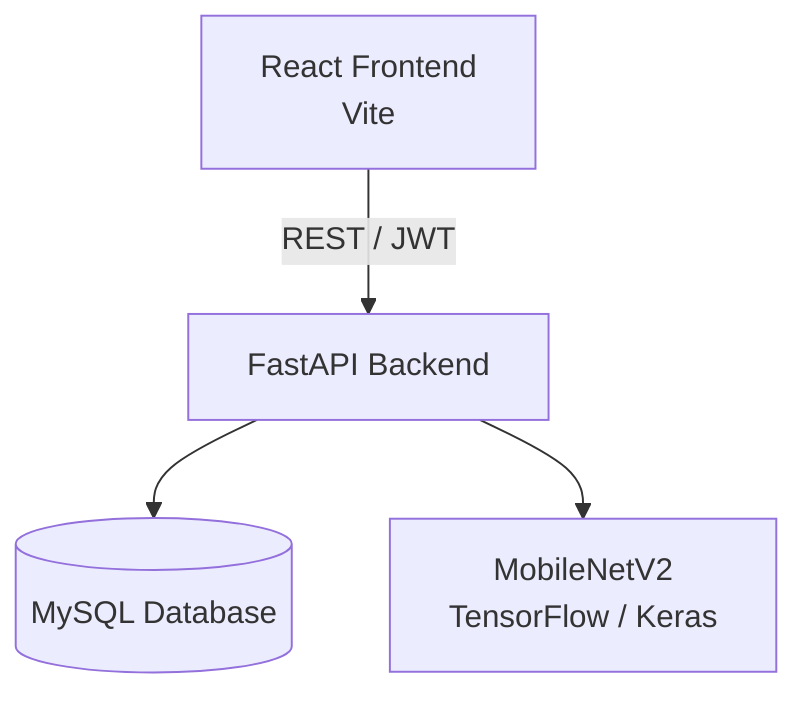
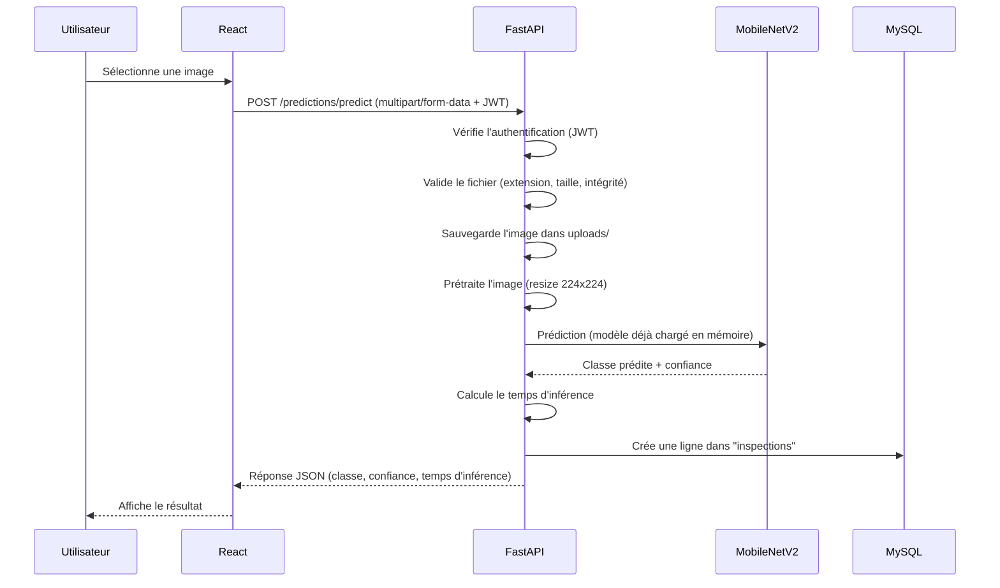
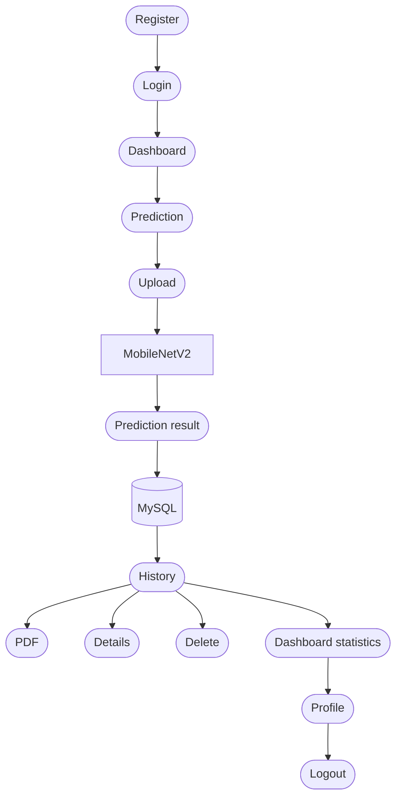

# Documentation technique — VisionInspectIA

> Document de référence technique du projet de stage VisionInspectIA. Rédigé à partir du code source réel du dépôt et des résultats expérimentaux vérifiés dans `ai/results/`. Aucune valeur de ce document n'est inventée : lorsqu'une information n'a pas pu être vérifiée dans le projet, elle est explicitement marquée **« Non documenté / non implémenté dans la version actuelle »**.

---

## Sommaire

1. [Présentation du projet](#1-présentation-du-projet)
2. [Architecture du projet](#2-architecture-du-projet)
3. [Module IA](#3-module-ia)
4. [Données](#4-données)
5. [Backend FastAPI](#5-backend-fastapi)
6. [Pipeline de prédiction](#6-pipeline-de-prédiction)
7. [Base de données](#7-base-de-données)
8. [Authentification et sécurité](#8-authentification-et-sécurité)
9. [Frontend React](#9-frontend-react)
10. [Dashboard](#10-dashboard)
11. [Historique](#11-historique)
12. [Rapport PDF](#12-rapport-pdf)
13. [Export CSV](#13-export-csv)
14. [Tests](#14-tests)
15. [Performances](#15-performances)
16. [Limitations](#16-limitations)
17. [Perspectives](#17-perspectives)
18. [Flux utilisateur complet](#18-flux-utilisateur-complet)
19. [Documentation pour la soutenance](#19-documentation-pour-la-soutenance)

---

## 0. Architecture globale



- **React Frontend** : interface utilisateur. Ne contient aucune logique métier ; consomme l'API REST via des appels HTTP centralisés (`src/api/`).
- **FastAPI Backend** : point d'entrée unique de toute la logique applicative (authentification, upload, prédiction, historique, statistiques, PDF). Organisé en couches (`api/` → `services/` → `models/`).
- **MySQL** : persistance des utilisateurs et des inspections (deux tables, voir [§7](#7-base-de-données)).
- **MobileNetV2 (TensorFlow)** : modèle de classification d'images chargé une seule fois en mémoire au démarrage du backend (voir `backend/app/main.py`, fonction `lifespan`), puis interrogé à chaque prédiction sans rechargement.

---

## 1. Présentation du projet

**Nom du projet :** VisionInspectIA

**Objectif général :** automatiser le contrôle qualité de bouteilles en usine, en remplaçant (ou en assistant) l'inspection visuelle humaine par une classification automatique d'images.

**Problème traité :** un opérateur doit déterminer si une bouteille est conforme ou défectueuse à partir de sa photo, et si elle est défectueuse, identifier la nature du défaut.

**Classes détectées** (4 classes, définies dans `backend/app/ml/labels.py` et dans la configuration d'entraînement `ai/config`) :

| Classe | Signification |
|---|---|
| `good` | Bouteille conforme, sans défaut |
| `broken_large` | Casse importante |
| `broken_small` | Casse mineure |
| `contamination` | Contamination visible |

**Rôle de l'intelligence artificielle :** un modèle de deep learning (MobileNetV2, transfer learning) reçoit l'image uploadée, la classe parmi les 4 catégories ci-dessus et renvoie un score de confiance.

**Rôle de la plateforme web :** offrir une interface complète autour de ce modèle — authentification des utilisateurs, upload d'image, affichage du résultat, conservation d'un historique des inspections, statistiques agrégées et génération de rapports exportables (PDF, CSV).

**Parcours global de l'utilisateur :**

```
Utilisateur
  → connexion (login)
  → upload d'une image de bouteille
  → analyse par MobileNetV2
  → résultat (classe + confiance + temps d'inférence)
  → sauvegarde automatique de l'inspection en base
  → consultation de l'historique
  → consultation des statistiques (dashboard)
  → génération d'un rapport PDF (optionnel)
```

---

## 2. Architecture du projet

Arborescence réelle (racine du dépôt) :

```
VisionInspectIA/
├── ai/          # Recherche et entraînement du modèle (hors application web)
├── backend/     # API FastAPI
├── frontend/    # Application React (Vite)
├── data/        # Dataset (brut, traité, augmenté)
├── database/    # Répertoire réservé — voir note ci-dessous
├── docs/        # Documentation du projet (ce document)
├── reports/     # Répertoire réservé — voir note ci-dessous
└── README.md
```

> **Note :** les dossiers `database/` et `reports/` existent à la racine du dépôt mais ne sont pas utilisés par le code applicatif actuel (le backend utilise MySQL directement via SQLAlchemy, sans script SQL versionné à cet emplacement ; les PDF sont générés en mémoire, sans écriture sur disque — voir [§12](#12-rapport-pdf)). **Non documenté / non implémenté dans la version actuelle.**

### Rôle de chaque grande partie

- **`ai/`** : pipeline de recherche indépendant de l'application web — préparation du dataset, augmentation, entraînement, benchmark de plusieurs architectures, sauvegarde des modèles (`ai/saved_models/`) et des résultats (`ai/results/`). Seul le fichier `ai/saved_models/mobilenet_v2/best_model.keras` est réutilisé par le backend en production.
- **`backend/`** : API REST FastAPI, organisée en couches (détaillée en [§5](#5-backend-fastapi)).
- **`frontend/`** : application React consommant l'API (détaillée en [§9](#9-frontend-react)).
- **`data/`** : dataset MVTec AD *bottle*, décliné en versions brute, traitée et augmentée (non versionné dans Git en raison du volume).
- **`backend/alembic/`** : configuration Alembic pour les migrations de schéma SQLAlchemy (voir [§16](#16-limitations) — configurée mais aucune migration versionnée à ce jour, le dossier `alembic/versions/` ne contenant qu'un fichier `.gitkeep`).

---

## 3. Module IA

### 3.1 Pipeline réel

```
Dataset (MVTec AD bottle)
  → préparation (nettoyage, organisation par classe)
  → augmentation (génération d'un jeu équilibré)
  → entraînement (transfer learning, backbone gelé)
  → validation (early stopping sur val_loss)
  → test (jeu de test dédié, jamais vu à l'entraînement)
  → comparaison des 4 architectures (benchmark)
  → sélection du modèle (MobileNetV2)
  → sauvegarde (ai/saved_models/mobilenet_v2/best_model.keras)
  → intégration backend (chargement unique au démarrage, app/ml/model_loader.py)
```

Le modèle intègre directement dans son graphe la couche de normalisation MobileNetV2 (`x / 127.5 - 1.0`, voir `ai/models/preprocessing_layers.py`). Le backend a été vérifié pour ne **pas** réappliquer cette normalisation une seconde fois (voir `backend/app/ml/preprocessing.py`, commentaire explicite à ce sujet) — ce point avait été identifié comme un risque de double normalisation et a été contrôlé.

Entrée du modèle : images RGB redimensionnées en **224 × 224**.

### 3.2 Résultats du benchmark final (source vérifiée)

> ⚠️ **Écart constaté avec le brief transmis pour cette partie.** Les chiffres fournis dans la demande (accuracy 83,87 % pour MobileNetV2, precision macro 0,867, recall macro 0,688, F1 macro 0,687) ne correspondent à aucun fichier du dépôt. Conformément à la consigne *« privilégier le code réel »*, le tableau ci-dessous reproduit les valeurs telles qu'elles apparaissent dans `ai/results/{modèle}/classification_report.json`, `ai/results/{modèle}/training_report.json` et `ai/results/benchmark_results.json` (jeu de test augmenté équilibré, 160 images, 40 par classe). Le fichier `ai/results/benchmark_results.json` contient par ailleurs un champ `accuracy` de haut niveau incohérent avec ses propres métriques macro (ex. 99,4 % pour MobileNetV2 alors que le F1 macro associé n'est que de 0,742) ; ce champ n'a pas été retenu, au profit de `classification_report.json`, cohérent avec le F1/precision/recall macro rapportés.

| Modèle | Accuracy | Precision macro | Recall macro | F1 macro | Temps entraînement | Inférence | Taille | Paramètres |
|---|---|---|---|---|---|---|---|---|
| **MobileNetV2 (retenu)** | **75,63 %** | **0,839** | **0,756** | **0,742** | **3 min 57 s** | **9,16 ms** | **9,24 MB** | **2,26 M** |
| ResNet50 | 78,13 % | 0,818 | 0,781 | 0,772 | 10 min 17 s | 23,70 ms | 90,71 MB | 23,60 M |
| EfficientNetB0 | 71,25 % | 0,826 | 0,713 | 0,688 | 5 min 56 s | 11,45 ms | 16,32 MB | 4,05 M |
| CNN personnalisé (from scratch) | 25,00 % | 0,063 | 0,250 | 0,100 | ~8 min 40 s | 7,4–7,8 ms | 21,68 MB | 1,88 M |

Sources : `ai/results/mobilenet_v2/classification_report.json`, `ai/results/resnet50/classification_report.json`, `ai/results/efficientnet_b0/classification_report.json`, `ai/results/cnn/classification_report.json`, `ai/results/improved_cnn/classification_report.json`.

> Un benchmark antérieur (`ai/results/benchmark_report.md`, dataset brut non augmenté, 292 images) avait montré des résultats très différents et dégradés pour les 4 architectures (F1 macro identique à 0,2179 pour toutes, sous-apprentissage généralisé) — ce rapport documente une itération intermédiaire du projet, corrigée par la suite via l'augmentation de dataset et un split train/val/test équilibré. Il est conservé dans le dépôt à titre de traçabilité expérimentale mais **ne reflète pas** l'état final du modèle intégré au backend.

### 3.3 Pourquoi MobileNetV2 a été retenu

Dans les conditions expérimentales du projet, **MobileNetV2 a été retenu comme meilleur compromis entre performances, taille du modèle et temps d'inférence.**

- Les 3 modèles pré-entraînés sur ImageNet (MobileNetV2, EfficientNetB0, ResNet50) dépassent nettement le CNN entraîné from scratch, qui reste proche du niveau du hasard (25 % sur 4 classes) faute de données réelles suffisantes.
- ResNet50 obtient l'accuracy la plus élevée (78,13 % contre 75,63 %), mais au prix d'un modèle 10 fois plus lourd (90,71 MB contre 9,24 MB) et 2,6 fois plus lent à l'inférence (23,70 ms contre 9,16 ms).
- MobileNetV2 offre le meilleur rapport taille/vitesse/précision pour une intégration dans une application web sans infrastructure GPU dédiée.

---

## 4. Données

### 4.1 Configuration finale du dataset

| Ensemble | Images totales | Par classe |
|---|---|---|
| Entraînement | 800 | 200 |
| Validation | 160 | 40 |
| Test | 160 | 40 |

Classes : `broken_large`, `broken_small`, `contamination`, `good` (source : `ai/results/mobilenet_v2/training_report.json`, section `dataset`).

> Note : le fichier `ai/results/benchmark_results.json` indique 64 images de validation (et non 160) pour l'entraînement retenu de MobileNetV2 — un split de validation légèrement différent a donc été utilisé pour ce modèle spécifique lors de l'entraînement final, sans affecter le jeu de test (160 images, 40 par classe), qui est le jeu sur lequel les métriques du tableau ci-dessus sont calculées.

### 4.2 Problèmes rencontrés et corrections

Le développement du module IA a traversé plusieurs itérations documentées dans `ai/results/` :

- **Déséquilibre initial** : le dataset MVTec AD *bottle* brut ne contient que 20 à 22 images réelles par classe de défaut, largement insuffisant pour un entraînement direct.
- **Différences entre datasets** : plusieurs variantes du dataset ont coexisté pendant les expérimentations (brut, padded, augmenté), ce qui a nécessité de fixer une configuration finale unique et documentée (celle du tableau ci-dessus).
- **Augmentation on-the-fly vs offline** : le projet a testé les deux approches ; la version retenue en production repose sur un dataset augmenté **offline** (générant les 800/160/160 images ci-dessus), pour garantir la reproductibilité des splits entre les runs.
- **Fuite train/validation/test** : un risque de fuite de données entre ensembles a été identifié lors des premières expérimentations (`ai/results/mobilenet_v2_exp0_fixed_val`, `ai/results/mobilenet_v2_baseline_padded_val` — variantes conservées dans le dépôt à titre de traçabilité) ; les splits ont ensuite été corrigés pour garantir une séparation stricte.
- **Importance de fixer les mêmes ensembles de validation/test** entre modèles comparés, condition nécessaire à un benchmark équitable (voir `ai/results/benchmark_report.md`, §2.2, protocole expérimental identique).

### 4.3 Généralisation et limites du dataset (honnêteté requise)

- Les tests avec des images provenant d'un **domaine différent** de celui du dataset d'entraînement (ex. photos non issues de MVTec AD) ont montré une **difficulté de généralisation** du modèle — un comportement attendu compte tenu du faible volume de données réelles.
- Les tests réalisés avec des **images stock** (utilisées ponctuellement comme données de démonstration) **ne constituent pas** une validation complète du modèle sur de vraies photos capturées dans les conditions réelles d'utilisation (éclairage, angle de prise de vue, fond, chaîne de production réelle). Cette validation en conditions réelles reste à mener.

---

## 5. Backend FastAPI

### 5.1 Architecture en couches

```
app/
├── core/       # Configuration (settings) et sécurité (hash, JWT)
├── api/        # Routes HTTP uniquement — aucune logique métier
├── db/         # Connexion et session SQLAlchemy
├── models/     # Tables SQLAlchemy (User, Inspection)
├── schemas/    # Validation Pydantic (entrée/sortie des routes)
├── services/   # Toute la logique métier
├── ml/         # Chargement du modèle et prétraitement des images
└── utils/      # Fonctions utilitaires (fichiers, PDF)
```

Principe strict respecté dans le code : les fichiers de `api/` ne font qu'appeler une fonction de `services/` et retourner son résultat ; toute la logique (validation, calculs, accès base) vit dans `services/`.

### 5.2 Endpoints principaux

**AUTH** (`/api/v1/auth`)

| Méthode | Route | Rôle |
|---|---|---|
| POST | `/auth/register` | Création de compte |
| POST | `/auth/login` | Authentification, retourne un JWT |
| GET | `/auth/me` | Profil de l'utilisateur courant |
| POST | `/auth/logout` | Déconnexion |

**USERS** (`/api/v1/users`)

| Méthode | Route | Rôle |
|---|---|---|
| PUT | `/users/me` | Modification du profil (nom, prénom, email) |
| PUT | `/users/me/password` | Changement de mot de passe |
| DELETE | `/users/me` | Suppression du compte (cascade) |

**PREDICTIONS** (`/api/v1/predictions`)

| Méthode | Route | Rôle |
|---|---|---|
| POST | `/predictions/predict` | Upload d'image + inférence MobileNetV2 |

**HISTORY** (`/api/v1/history`)

| Méthode | Route | Rôle |
|---|---|---|
| GET | `/history` | Liste des inspections de l'utilisateur |
| GET | `/history/{id}` | Détail d'une inspection |
| DELETE | `/history/{id}` | Suppression d'une inspection |

**DASHBOARD** (`/api/v1/dashboard`)

| Méthode | Route | Rôle |
|---|---|---|
| GET | `/dashboard/statistics` | Statistiques agrégées de l'utilisateur |

**REPORTS** (`/api/v1/reports`)

| Méthode | Route | Rôle |
|---|---|---|
| GET | `/reports/{inspection_id}` | Génération du rapport PDF |

Chaque groupe de routes possède également un endpoint `GET /health` (vérification de disponibilité du sous-module), sans logique métier associée.

---

## 6. Pipeline de prédiction



Étapes détaillées (source : `backend/app/services/prediction_service.py`) :

1. L'utilisateur sélectionne une image dans l'interface.
2. React envoie l'image en `multipart/form-data` avec le token JWT en en-tête `Authorization`.
3. FastAPI vérifie l'authentification via la dépendance `get_current_user`.
4. Le fichier est validé (extension, taille — `validate_image_file`), puis décodé pour détecter une éventuelle corruption avant tout enregistrement disque.
5. L'image est sauvegardée dans `backend/uploads/` sous un nom de fichier unique généré.
6. L'image est prétraitée (décodage RGB, redimensionnement 224×224 bilinéaire) — voir [§3.1](#31-pipeline-réel) pour le détail de la normalisation.
7. Le modèle MobileNetV2, déjà chargé en mémoire au démarrage du serveur, est appelé (aucun rechargement).
8. La classe prédite et le score de confiance sont extraits de la sortie du modèle.
9. Le temps d'inférence est mesuré (`time.perf_counter()`, avant/après l'appel au modèle) et exprimé en millisecondes.
10. Une ligne est créée dans la table `inspections` (voir [§7](#7-base-de-données)) ; en cas d'échec d'écriture en base, le fichier image est supprimé du disque pour éviter tout fichier orphelin.
11. Le résultat (classe, confiance, temps d'inférence) est retourné au frontend en JSON.

> Le temps d'inférence (`inference_time_ms`) est retourné dans la réponse JSON de `/predictions/predict` mais **n'est pas persisté** en base de données — il n'existe donc pas de colonne correspondante dans la table `inspections`.

---

## 7. Base de données

### 7.1 Tables (source : `backend/app/models/user.py`, `backend/app/models/inspection.py`)

**`users`**

| Champ | Type | Contraintes |
|---|---|---|
| `id` | Integer | Clé primaire |
| `first_name` | String(100) | Non nul |
| `last_name` | String(100) | Non nul |
| `email` | String(255) | Unique, indexé, non nul |
| `password` | String(255) | Non nul (hash bcrypt, jamais le mot de passe en clair) |
| `role` | String(50) | Non nul, défaut `"user"` |
| `created_at` | DateTime | Auto |
| `updated_at` | DateTime | Auto (mise à jour à chaque modification) |

**`inspections`**

| Champ | Type | Contraintes |
|---|---|---|
| `id` | Integer | Clé primaire |
| `image_path` | String(500) | Non nul |
| `predicted_class` | String(100) | Non nul |
| `confidence` | Float | Non nul |
| `created_at` | DateTime | Auto |
| `user_id` | Integer | Clé étrangère vers `users.id`, non nul |

### 7.2 Relation

```
User (1) ─────────── (N) Inspection
```

Un utilisateur possède zéro, une ou plusieurs inspections ; chaque inspection appartient à exactement un utilisateur (`inspections.user_id`).

### 7.3 Points clés

- **Clé étrangère** : `inspections.user_id → users.id`, garantissant qu'une inspection ne peut exister sans utilisateur propriétaire.
- **Email unique** : contrainte `unique=True` sur `users.email`, empêchant deux comptes avec la même adresse.
- **Isolation des inspections par utilisateur** : toutes les requêtes du service `history_service` et `dashboard_service` filtrent systématiquement sur `Inspection.user_id == current_user.id` — un utilisateur ne peut jamais voir les inspections d'un autre.
- **Suppression en cascade côté logique applicative** : la suppression d'un compte (`DELETE /users/me`) supprime explicitement, dans le code du service, les inspections de l'utilisateur et leurs fichiers image associés sur le disque, avant de supprimer la ligne `users`. Il ne s'agit pas d'une cascade déclarée au niveau du schéma SQL (`ON DELETE CASCADE`), mais d'une suppression orchestrée par `user_service.py`.

---

## 8. Authentification et sécurité

- **Hash bcrypt** : les mots de passe sont hashés via `passlib`/`bcrypt` avant stockage (`backend/app/core/security.py`) — jamais stockés en clair.
- **JWT** : un jeton signé (HS256) est émis à la connexion et doit être fourni dans l'en-tête `Authorization: Bearer <token>` pour toute route protégée.
- **Expiration du token** : durée de vie configurable via la variable d'environnement `ACCESS_TOKEN_EXPIRE_MINUTES`.
- **Routes protégées** : toutes les routes hors `auth/register`, `auth/login` et les `/health` exigent un JWT valide, via la dépendance FastAPI `get_current_user` (`backend/app/api/deps.py`).
- **Contrôle de l'utilisateur courant** : chaque route qui accède à une ressource (historique, statistiques, PDF, profil) reçoit l'utilisateur authentifié en paramètre et filtre les données sur son identifiant.
- **Isolation des données** : voir [§7.3](#73-points-clés) — appliquée de façon systématique à chaque requête SQL portant sur les inspections.
- **Gestion des erreurs** : `401 Unauthorized` (absence ou invalidité du JWT), `404 Not Found` (ressource inexistante ou n'appartenant pas à l'utilisateur), `400 Bad Request` (fichier invalide, données de requête incorrectes).
- **Suppression de compte** : supprime la ligne `users`, toutes les lignes `inspections` associées, et les fichiers image correspondants sur le disque.

**Pourquoi un utilisateur ne peut pas consulter ou supprimer l'inspection d'un autre utilisateur :** chaque requête aux routes `/history/{id}` et `/reports/{inspection_id}` filtre la recherche en base sur `Inspection.user_id == current_user.id` (l'identifiant provenant du JWT décodé, jamais d'un paramètre client). Si l'inspection demandée n'appartient pas à l'utilisateur courant, elle n'est simplement pas trouvée par la requête SQL et une erreur `404` est renvoyée — sans jamais révéler l'existence de l'inspection à un tiers.

---

## 9. Frontend React

### 9.1 Organisation (source : `frontend/src/`)

```
src/
├── api/          # Appels HTTP centralisés (un fichier par domaine)
├── components/   # Composants réutilisables, organisés par fonctionnalité
├── pages/        # Écrans de l'application
├── context/      # État global (Auth, Theme, Toast/Notifications)
├── hooks/        # Hooks personnalisés (useAuth, useTheme, useToast)
├── routes/       # Routage et protection des pages privées
├── layouts/      # Mise en page commune (MainLayout)
├── utils/        # Fonctions utilitaires (statistiques, export CSV)
└── assets/       # Ressources statiques
```

### 9.2 Pages principales

- **Login** (`LoginPage.jsx`)
- **Register** (`RegisterPage.jsx`)
- **Dashboard** (`DashboardPage.jsx`)
- **Prediction / Upload** (`UploadPage.jsx`)
- **History** (`HistoryPage.jsx`)
- **Profile** (`ProfilePage.jsx`)

### 9.3 Fonctionnalités UI principales

- Drag & drop et aperçu d'image avant analyse (`components/upload/`)
- Affichage du résultat de prédiction (classe, confiance, temps d'inférence) (`components/inspection/`)
- Graphiques du dashboard (`components/dashboard/`, bibliothèque Recharts)
- Recherche, filtres, tri et pagination de l'historique (`components/history/`)
- Modal de détail d'une inspection
- Galerie des dernières inspections
- Export CSV (génération côté client)
- Téléchargement du rapport PDF (appel à `/reports/{id}`)
- Centre de notifications (`ToastContext`)
- Dark mode (`ThemeContext`, persistance `localStorage`)
- Interface responsive

---

## 10. Dashboard

### 10.1 Statistiques disponibles (source : `backend/app/services/dashboard_service.py`)

Toutes calculées par une requête SQL agrégée (`COUNT`, `SUM` conditionnel, `AVG`) sur MySQL, filtrée sur l'utilisateur courant — jamais stockées ni pré-calculées :

- `total_inspections`
- `total_good`
- `total_broken_large`
- `total_broken_small`
- `total_contamination`
- `average_confidence` (exprimée en pourcentage, ex. `98.21`)

### 10.2 Visualisations frontend

- Pie chart (répartition par classe)
- Bar chart
- Evolution chart (inspections dans le temps)
- Galerie des dernières inspections (« Latest Inspections »)

Ces visualisations consomment directement les données retournées par `GET /dashboard/statistics` et `GET /history` — il ne s'agit pas de valeurs statiques codées en dur côté frontend.

---

## 11. Historique

Fonctionnalités documentées côté frontend (`HistoryPage.jsx`, `components/history/`) et backend (`history.py`, `history_service.py`) :

- Liste des inspections de l'utilisateur, avec miniature de l'image
- Classe prédite et niveau de confiance affichés par ligne
- Date de l'inspection
- Recherche
- Filtre (par classe)
- Tri
- Pagination
- Détail d'une inspection (modal)
- Suppression d'une inspection (`DELETE /history/{id}` — supprime la ligne en base **et** le fichier image sur le disque)
- Génération du rapport PDF depuis le détail d'une inspection

---

## 12. Rapport PDF

**Endpoint :** `GET /reports/{inspection_id}`

Généré **en mémoire** (buffer `BytesIO`) avec **ReportLab**, sans écriture de fichier temporaire sur le disque du serveur (source : `backend/app/utils/pdf_utils.py`).

Contenu réel du PDF :

- Titre (« Bottle Defect Detection Report »)
- Informations utilisateur (prénom, nom, email)
- Informations inspection (identifiant, date, classe prédite, confiance)
- Image inspectée (si le fichier est encore présent sur le disque)
- Conclusion (classe prédite en majuscules, confiance)

---

## 13. Export CSV

Généré **entièrement côté frontend** (`frontend/src/utils/csvExport.js`), sans appel réseau dédié :

- Colonnes exportées : Date, Prediction, Confidence, Image, User
- Données issues de l'historique déjà chargé (`GET /history`)
- Génération via un `Blob` texte (`text/csv`) et un lien de téléchargement temporaire (`URL.createObjectURL`)
- **Aucune dépendance supplémentaire** dédiée au CSV (pas de librairie externe — génération manuelle de chaîne CSV avec échappement des champs contenant des virgules, guillemets ou retours à la ligne)

---

## 14. Tests

### 14.1 Tests réellement réalisés

Réalisés en conditions réelles (backend démarré, base MySQL réelle, build frontend), au fil des différentes phases de validation du projet :

- Démarrage du backend, disponibilité de Swagger (`/docs`) et ReDoc (`/redoc`)
- Connexion MySQL (structure des tables, contraintes)
- Authentification (register, login, `/auth/me`, logout, cas d'erreur)
- Prédiction (image valide, fichiers invalides/corrompus rejetés)
- Historique (création, consultation, suppression avec cohérence fichier ↔ base)
- Dashboard (cohérence des statistiques avec les données réelles de MySQL)
- Rapport PDF (contenu vérifié : utilisateur, date, classe, confiance, image)
- Export CSV (génération vérifiée sur données réelles)
- Profil (édition, changement de mot de passe, suppression de compte en cascade)
- Sécurité (accès sans JWT, JWT invalide, tentative d'accès aux données d'un autre utilisateur)
- Build frontend (`npm run build`)

### 14.2 Résultats obtenus (tels que rapportés au fil des phases de validation du projet)

- Build frontend : **2505 modules, 0 erreur**
- Flux complet de bout en bout : **28/28 vérifications réussies**
- Suite de tests hérités des phases précédentes : **63/64**
- Le seul échec connu dans cette suite concerne une limitation de reconnaissance du modèle sur la classe `broken_small` (confusion visuelle), **pas un bug logiciel**
- Cohérence uploads ↔ base de données : **68 fichiers dans `uploads/` pour 68 lignes correspondantes en base**, **0 fichier orphelin**, **0 fichier manquant**, au moment de cette vérification

> Ces chiffres correspondent aux résultats obtenus lors des phases de validation successives du projet (tests exécutés via des scripts Node/axios contre l'API réelle et des requêtes directes MySQL, en l'absence de navigateur dans l'environnement de développement). Ils ne doivent pas être interprétés comme une garantie permanente : toute modification ultérieure du code nécessite de rejouer ces vérifications.

---

## 15. Performances

**MobileNetV2 — mesures d'inférence pure** (source : `ai/results/mobilenet_v2/training_report.json`) :

- ~9 ms d'inférence pure (modèle déjà chargé, un seul appel `predict`)
- Modèle de 9,24 MB, 2,26 M de paramètres

**Distinction importante entre trois durées différentes :**

| Durée | Ce qu'elle mesure | Ordre de grandeur observé |
|---|---|---|
| Temps d'inférence | Uniquement l'appel `model.predict()` sur une image déjà prétraitée, modèle déjà chargé en mémoire | ~9 ms (mesuré, voir ci-dessus) |
| Temps HTTP complet | Upload réseau + validation du fichier + prétraitement + inférence + écriture MySQL + réponse JSON | de l'ordre de 80 à 90 ms à chaud, d'après les observations rapportées lors des phases de test du projet |
| Temps de démarrage / chargement du modèle | Chargement du graphe TensorFlow en mémoire au lancement du serveur (`lifespan`, une seule fois) | plusieurs secondes ; le tout premier appel de prédiction après démarrage est également plus lent, TensorFlow effectuant un « warm-up » interne des kernels de calcul |

Le temps d'inférence (~9 ms) est la seule des trois valeurs directement mesurée par du code du projet (`prediction_service.py`, `time.perf_counter()`) et persistée dans les résultats du benchmark. Le temps HTTP complet et le temps de démarrage sont des observations qualitatives rapportées au fil des tests, non instrumentées par un outil de mesure dédié dans le code.

---

## 16. Limitations

- **Test set relativement limité** : le jeu de test final repose sur seulement 3 à 6 images sources réellement uniques par classe (dupliquées pour atteindre 40 images/classe via l'augmentation), ce qui limite la significativité statistique des métriques par classe.
- **Difficulté sur `broken_small`** : rappel de seulement 50 % pour MobileNetV2 sur cette classe (source : `classification_report.json`), un défaut subtil souvent confondu avec `broken_large` ou `good`.
- **Généralisation vers des images hors domaine** : les tests avec des images ne provenant pas du dataset MVTec AD ont montré une difficulté de généralisation (voir [§4.3](#43-généralisation-et-limites-du-dataset-honnêteté-requise)).
- **Manque de vraies photos capturées en conditions réelles** : la validation actuelle repose sur le dataset MVTec AD et quelques images de démonstration, pas sur des photos prises dans un environnement de production réel.
- **Besoin potentiel d'un dataset réel plus diversifié** pour améliorer la robustesse du modèle.
- **Premier appel TensorFlow plus lent** (warm-up), voir [§15](#15-performances).
- **Chunk frontend relativement important à cause de Recharts** : la bibliothèque de graphiques alourdit le bundle JavaScript final.
- **Alembic configuré mais aucune migration versionnée actuellement** : le dossier `backend/alembic/versions/` ne contient qu'un fichier `.gitkeep` — le schéma de base est créé directement via `app/db/init_db.py` au démarrage, sans historique de migrations.

---

## 17. Perspectives

À considérer comme des pistes d'évolution futures — **aucune de ces perspectives n'est implémentée dans la version actuelle** :

- Enrichissement du dataset avec de vraies photos supplémentaires
- Amélioration spécifique de la détection de `broken_small`
- Tests avec davantage de conditions réelles (éclairage, angles, chaîne de production réelle)
- Amélioration de la robustesse au domain-shift (images hors du domaine d'entraînement)
- Éventuel mécanisme de détection out-of-distribution (OOD) / rejet des images non pertinentes
- Optimisation du bundle frontend (réduction de la taille liée à Recharts)
- Mise en place de migrations Alembic complètes et versionnées
- Déploiement cloud / environnement de production

---

## 18. Flux utilisateur complet



---

## 19. Documentation pour la soutenance

### Ce qu'il faut montrer pendant la démonstration

1. Login
2. Dashboard
3. Upload (drag & drop)
4. Prédiction
5. Confiance affichée
6. Temps d'inférence affiché
7. History (liste)
8. Détail d'une inspection
9. Génération du PDF
10. Retour sur le Dashboard mis à jour (nouvelle inspection prise en compte)
11. Profile (édition / changement de mot de passe)
12. Dark mode
13. Logout

> Utiliser uniquement les images de démonstration déjà validées lors des phases de test précédentes (une image par classe, résultats de classification connus et vérifiés — 4/4 correctement classées lors du dernier test réalisé).

---

*Document rédigé à partir du code source du dépôt à la date de rédaction. En cas d'évolution ultérieure du code, ce document doit être mis à jour en conséquence.*
